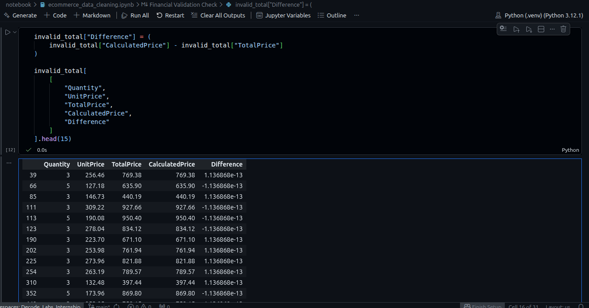

# 🧹 E-Commerce Data Cleaning & Preparation

> *Clean data is the foundation of reliable analytics.*

This project focuses on cleaning, validating, and standardizing a raw e-commerce transaction dataset using Python and Pandas.

The objective was to improve data quality by:
- Handling missing values
- Verifying duplicate records
- Standardizing categorical fields
- Validating financial calculations
- Ensuring dataset consistency for future analysis

---

## 📊 Dataset Information

| Property | Detail |
|---|---|
| Dataset Type | E-Commerce Transaction Data |
| Records | 1,200 rows |
| Features | 14 columns |
| File Format | Excel (`.xlsx`) |
| Tools Used | Python, Pandas, Jupyter Notebook |

---
### Key Columns

- `OrderID` — Unique order identifier
- `Date` — Transaction date
- `CustomerID` — Customer identifier
- `Product` — Purchased product
- `Quantity` — Number of items purchased
- `UnitPrice` — Price per unit
- `PaymentMethod` — Payment type used
- `OrderStatus` — Current order status
- `CouponCode` — Applied discount coupon
- `TotalPrice` — Final transaction amount

---
## 🧹 Data Cleaning Process
| Step	|Action Performed |
|---|---|
|Missing Values	 | Filled missing CouponCode values with "No Coupon"
|Duplicate Validation |	Checked for duplicate rows, OrderID, and TrackingNumber
|Data Type Validation |	Verified date and numeric column formats
|Financial Validation |	Confirmed TotalPrice = Quantity × UnitPrice
|Floating-Point Handling |	Used numpy.isclose() for accurate financial comparison
|Text Standardization |	Cleaned and standardized categorical text columns
|Export |	Generated cleaned CSV dataset for future analysis
---
## ✅ Validation Checks

The dataset was validated to ensure:

- Zero missing values
- Zero duplicate records
- Zero duplicate order IDs
- Zero duplicate tracking numbers
- Correct financial calculations
- Consistent categorical formatting
### Financial Validation Logic

```
df["CalculatedPrice"] = (
    df["Quantity"] * df["UnitPrice"]
).round(2)

invalid_total = df[
    ~np.isclose(
        df["CalculatedPrice"],
        df["TotalPrice"]
    )
]
```
#### This validation confirmed that all transaction totals were logically accurate after handling floating-point precision differences.
---
## 📸 Screenshots

### Dataset Preview :


### Missing Value Validation:


### Final Clean Dataset:

---
### 📁 Project Structure
```
Ecommerce-Data-Cleaning/
│
├── assets/
│   ├── dataset_preview.png
│   ├── missing_values_check.png
│   ├── validation_check.png
│   └── final_output.png
│
├── data/
│   ├── Dataset for Data Analytics.xlsx
│   └── cleaned_ecommerce_data.csv
│
├── notebook/
│   └── ecommerce_data_cleaning.ipynb
│
├── README.md
└── requirements.txt
```
---

### ✅ Conclusion

The raw e-commerce dataset was successfully cleaned and validated using Python and Pandas.

Key outcomes of the project:

- Improved dataset consistency
- Validated financial integrity
- Standardized categorical values
- Prepared the dataset for analysis and visualization

This project demonstrates practical data cleaning and validation techniques commonly used in real-world analytics workflows.

---
### 👤 Author

Vara Prasad K
Aspiring Data Analyst | Python · SQL · Pandas · Power BI

- GitHub: https://github.com/prasadk1628
- LinkedIn: https://www.linkedin.com/in/vara-prasad-k-4a6026230/