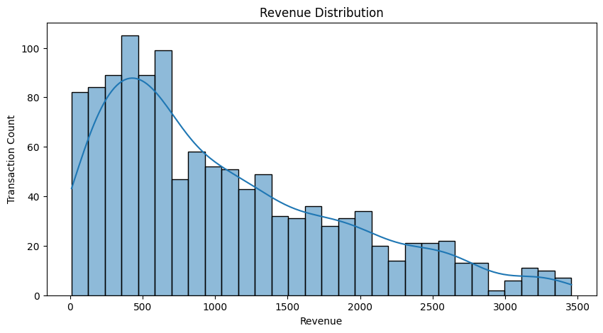
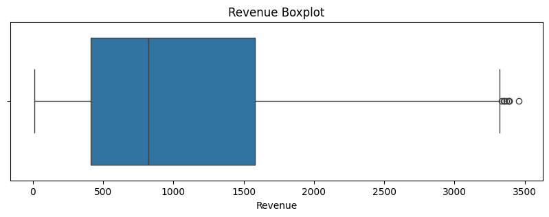
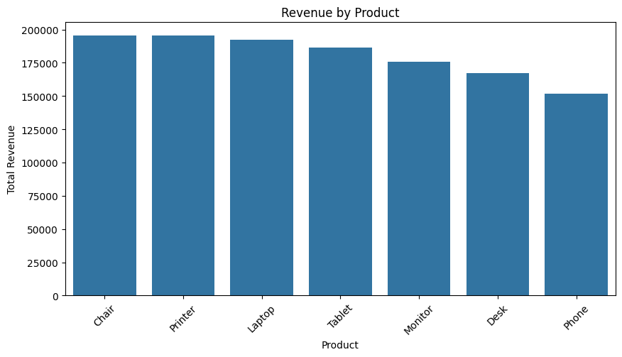
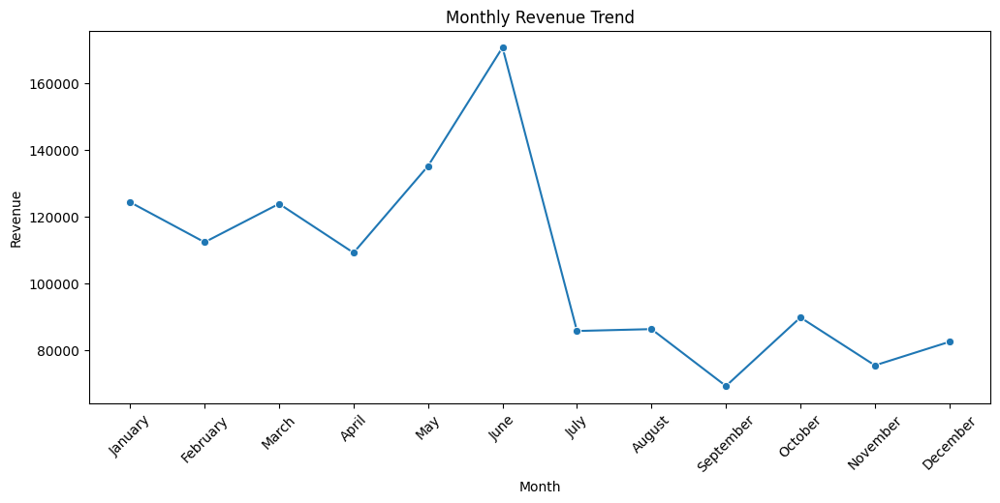
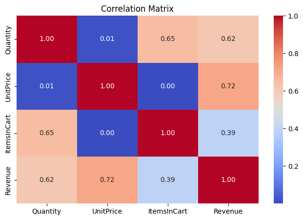

# 📊 Exploratory Data Analysis (EDA) on E-Commerce Transactions

> *Data becomes valuable only when patterns are transformed into actionable insights.*

This project focuses on performing Exploratory Data Analysis (EDA) on an e-commerce transaction dataset using Python and visualization techniques.

The objective was to analyze customer purchasing behavior, identify revenue patterns, detect outliers, and uncover relationships between variables to support data-driven decision-making.

This project was completed as part of the DecodeLabs Data Analytics Internship — Project 2: Exploratory Data Analysis (EDA). 

---

## 📌 Project Objective

The primary goals of this analysis were to:

* Understand transaction and revenue distributions
* Identify purchasing trends across products and months
* Detect statistical outliers in transaction revenue
* Analyze relationships between pricing, quantity, and revenue
* Extract meaningful business insights from transactional data

---

## 📊 Dataset Information

| Property      | Detail                          |
| ------------- | ------------------------------- |
| Dataset Type  | E-Commerce Transaction Data     |
| Records       | 1,200 rows                      |
| Features      | 14 columns                      |
| File Format   | CSV / Excel                     |
| Analysis Type | Exploratory Data Analysis (EDA) |

### Key Columns

* `OrderID` — Unique order identifier
* `Date` — Transaction date
* `Product` — Purchased product category
* `Quantity` — Number of items purchased
* `UnitPrice` — Price per unit
* `ItemsInCart` — Total cart items
* `PaymentMethod` — Transaction payment mode
* `ReferralSource` — Customer acquisition source
* `Revenue` — Calculated transaction revenue

---

## 🛠️ Tools & Technologies

| Tool             | Purpose                           |
| ---------------- | --------------------------------- |
| Python           | Core analysis language            |
| Pandas           | Data manipulation & aggregation   |
| NumPy            | Statistical operations            |
| Matplotlib       | Data visualization                |
| Seaborn          | Statistical plotting              |
| Jupyter Notebook | Interactive analysis environment  |
| GitHub           | Version control & project hosting |

---

## 🧹 Data Preparation

Before analysis, the dataset was validated and prepared using the cleaned output from Project 1.

### Preparation Steps

* Loaded cleaned dataset from previous workflow
* Verified missing values and duplicates
* Standardized categorical fields
* Created engineered features:

  * `Year`
  * `Month`
  * `Day`
  * `Revenue`

---

## 📈 Exploratory Data Analysis

### 1. Revenue Distribution Analysis

* Revenue distribution showed positive/right skewness
* Majority of transactions fall within lower-to-mid revenue ranges
* High-value transactions extend the upper revenue tail

### 2. Revenue Boxplot Analysis

* Statistical outliers were detected in high-revenue transactions
* Outliers were identified as legitimate high-value purchases rather than data errors
* Revenue variability across transactions was moderate to high

### 3. Product Revenue Analysis

* Chairs and Printers generated the highest total revenue
* Phones contributed the lowest overall revenue
* Revenue contribution across products remained relatively balanced

### 4. Monthly Revenue Trend Analysis

* Revenue trends displayed noticeable volatility across months
* June recorded the highest overall revenue performance
* Significant revenue decline occurred after June, indicating possible seasonal concentration

### 5. Correlation Analysis

| Variables             | Correlation |
| --------------------- | ----------- |
| UnitPrice ↔ Revenue   | 0.72        |
| Quantity ↔ Revenue    | 0.62        |
| ItemsInCart ↔ Revenue | 0.39        |

Key observations:

* Revenue is strongly influenced by product pricing and purchase quantity
* Cart size alone has weaker influence on revenue generation
* Quantity and UnitPrice showed almost no direct relationship

### 6. Outlier Detection (IQR Method)

IQR-based analysis identified multiple high-revenue transactions caused by:

* high-priced products,
* combined with maximum purchase quantities.

These outliers represented meaningful business signals rather than anomalies.

---

## 💡 Key Business Insights

1. Revenue distribution is positively skewed, indicating the presence of high-value transactions contributing disproportionately to overall sales.

2. Revenue generation is primarily influenced by product pricing and purchase quantities.

3. Product revenue contribution appears diversified, reducing dependency on a single product category.

4. Monthly revenue volatility suggests possible seasonal purchasing behavior.

5. High-value transactions represent premium purchasing patterns rather than invalid data records.

---

## 📌 Business Recommendations

* Investigate factors contributing to June’s revenue spike for repeatable sales opportunities.
* Develop strategies targeting high-value customer segments.
* Optimize pricing and bundle strategies to improve revenue generation.
* Monitor seasonal purchasing trends for inventory planning.
* Track premium transactions separately for customer segmentation analysis.

---

## 📸 Screenshots

### Revenue Distribution



### Revenue Boxplot



### Revenue by Product



### Monthly Revenue Trend



### Correlation Heatmap



---

## 📁 Project Structure

```text
Project_2_EDA/
│
├── assets/
│   ├── revenue_distribution.png
│   ├── revenue_boxplot.png
│   ├── revenue_by_product.png
│   ├── monthly_revenue_trend.png
│   └── correlation_heatmap.png
│
├── data/
│   ├── Dataset for Data Analytics.xlsx
│   └── cleaned_ecommerce_data.csv
│
├── notebook/
│   └── exploratory_data_analysis.ipynb
│
├── README.md
└── requirements.txt
```

---

## ✅ Conclusion

This project demonstrates the practical application of Exploratory Data Analysis (EDA) techniques to uncover meaningful insights from transactional e-commerce data.

The analysis successfully identified:

* revenue distribution patterns,
* seasonal fluctuations,
* product-level performance,
* variable relationships,
* and high-value transaction behavior.

The project highlights how analytical reasoning and visualization can transform raw transaction records into actionable business intelligence.

---

## 👤 Author

**Vara Prasad K**
Aspiring Data Analyst | Python · SQL · Pandas · Tableau

* GitHub: https://github.com/prasadk1628
* LinkedIn: https://www.linkedin.com/in/vara-prasad-k-4a6026230/
